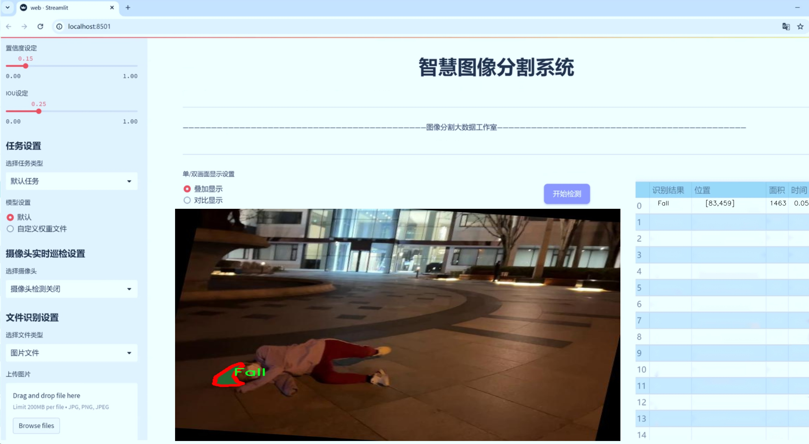
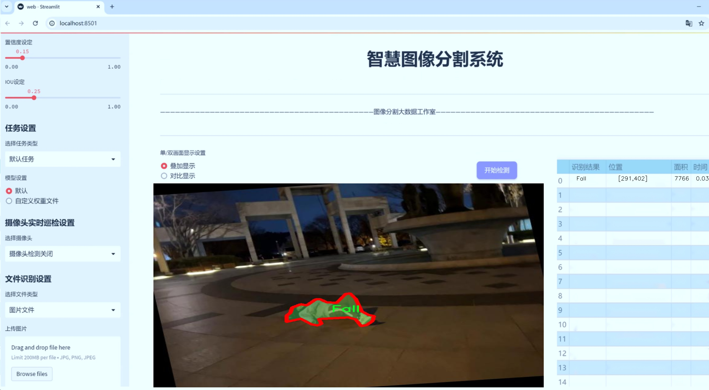
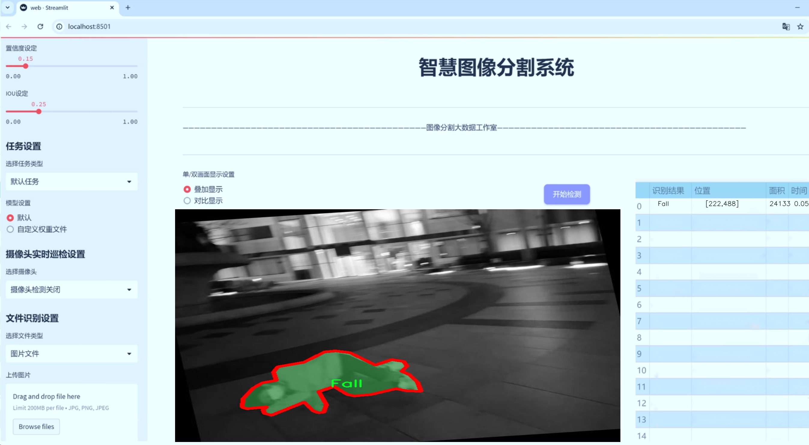
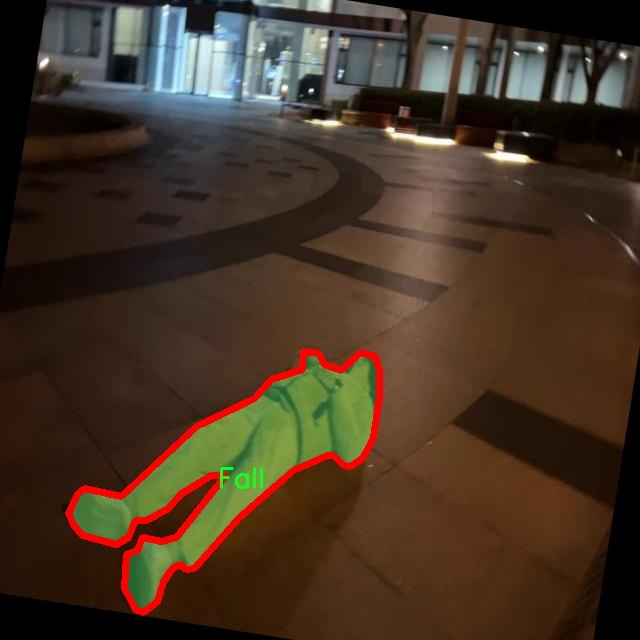
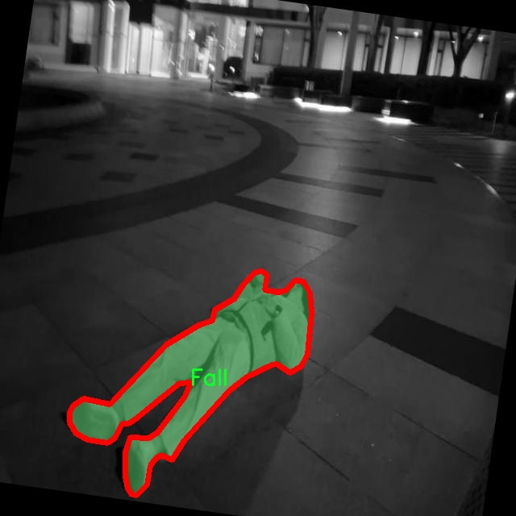
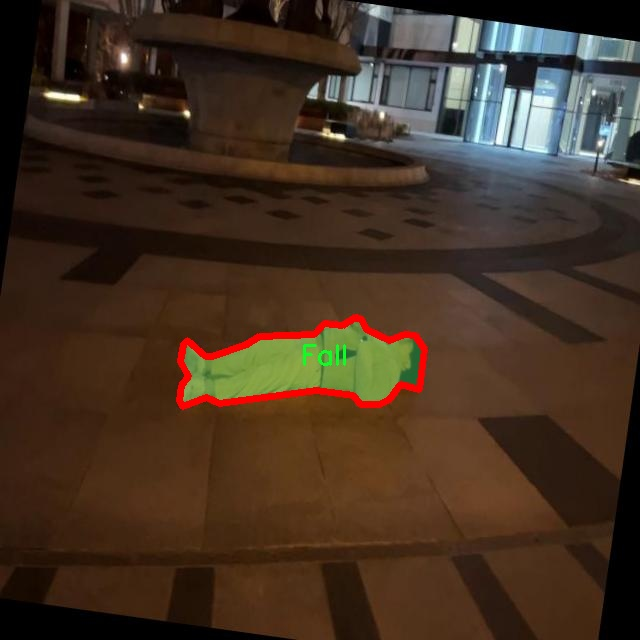
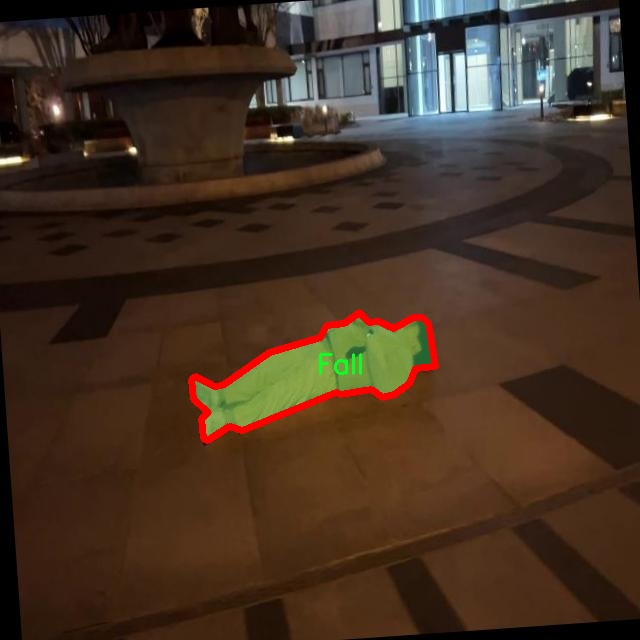
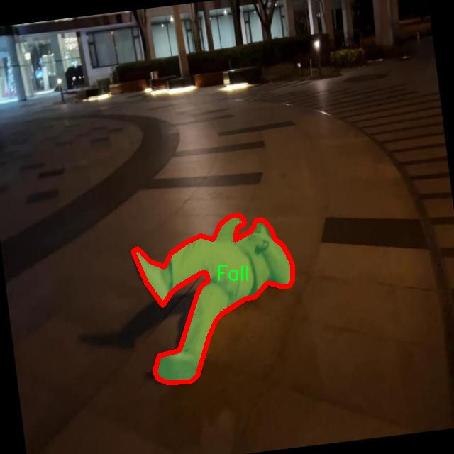

# 人员跌倒图像分割系统： yolov8-seg-C2f-RFCAConv

### 1.研究背景与意义

[参考博客](https://gitee.com/YOLOv8_YOLOv11_Segmentation_Studio/projects)

[博客来源](https://kdocs.cn/l/cszuIiCKVNis)

研究背景与意义

随着全球老龄化进程的加速，跌倒已成为老年人群体中一种常见且严重的意外事故，给个人及其家庭带来了巨大的心理和经济负担。根据世界卫生组织的统计，全球每年因跌倒导致的死亡人数高达65万，且这一数字在老年人中尤为突出。因此，开发有效的跌倒检测与预防系统，尤其是基于计算机视觉技术的自动化监测系统，显得尤为重要。近年来，深度学习技术的迅猛发展为图像处理和分析提供了新的思路和方法，其中YOLO（You Only Look Once）系列模型因其高效的实时检测能力而广泛应用于各类视觉任务。

在此背景下，基于改进YOLOv8的人员跌倒图像分割系统应运而生。YOLOv8作为YOLO系列的最新版本，具备更强的特征提取能力和更高的检测精度，能够在复杂环境中实现对目标的快速识别和定位。通过对YOLOv8模型的改进，结合实例分割技术，可以更精确地识别和分割跌倒行为与正常站立状态。这种方法不仅可以提高跌倒检测的准确性，还能为后续的行为分析和预警系统提供更为丰富的信息支持。

本研究所使用的数据集包含1900幅图像，涵盖了“跌倒”和“站立”两个类别。这一数据集的构建为模型的训练和评估提供了坚实的基础。通过对这两个类别的深入分析，研究者可以识别出跌倒行为的关键特征，并在此基础上优化模型的性能。此外，数据集的规模和多样性为模型的泛化能力提供了保障，使其能够在不同场景下保持良好的检测效果。

研究的意义不仅体现在技术层面，更在于其对社会的积极影响。通过建立一个高效的跌倒检测系统，可以在老年人日常生活中提供实时监测和预警，降低跌倒事故的发生率，进而提高老年人的生活质量。同时，该系统还可以为护理人员和家庭成员提供重要的辅助决策支持，帮助他们及时采取措施，避免悲剧的发生。此外，研究成果也可为其他领域的图像分割与行为识别提供借鉴，推动相关技术的进一步发展。

综上所述，基于改进YOLOv8的人员跌倒图像分割系统的研究，不仅具有重要的学术价值，更具备广泛的应用前景。通过这一研究，期望能够为老年人跌倒预防提供新的解决方案，推动智能监护技术的发展，为构建更加安全、健康的社会贡献力量。

### 2.图片演示







注意：本项目提供完整的训练源码数据集和训练教程,由于此博客编辑较早,暂不提供权重文件（best.pt）,需要按照6.训练教程进行训练后实现上图效果。

### 3.视频演示

[3.1 视频演示](https://www.bilibili.com/video/BV1FAUPYMEeC/)

### 4.数据集信息

##### 4.1 数据集类别数＆类别名

nc: 2
names: ['Fall', 'Stand']


##### 4.2 数据集信息简介

数据集信息展示

在本研究中，我们使用了名为“human detect”的数据集，以训练和改进YOLOv8-seg模型，旨在实现高效的人员跌倒图像分割系统。该数据集专注于两种主要的行为类别，分别是“Fall”（跌倒）和“Stand”（站立），这为模型提供了清晰的分类框架，便于其在实际应用中进行准确的行为识别与分割。

“human detect”数据集的设计理念是为了模拟真实环境中人类活动的多样性，尤其是在老年人和行动不便者的日常生活中，跌倒事件的监测与识别显得尤为重要。数据集中包含了大量的图像样本，这些样本涵盖了不同的光照条件、背景环境以及人物姿态，确保了模型在训练过程中能够学习到丰富的特征。这种多样性不仅提高了模型的泛化能力，也增强了其在复杂场景下的表现。

数据集中的“Fall”类别包含了多种跌倒姿态的图像，例如前倾跌倒、侧向跌倒和后仰跌倒等。这些样本展示了跌倒时不同的身体姿态和运动轨迹，帮助模型理解在不同情况下人类如何失去平衡并倒下。通过对这些跌倒行为的精确标注，YOLOv8-seg能够学习到关键的特征点，从而在实时监测中有效识别出跌倒事件。

另一方面，“Stand”类别则提供了多种站立姿态的图像，这些图像不仅包括正常站立的姿势，还涵盖了站立时的微小动作，如转身、弯腰等。这些细微的变化对模型的训练至关重要，因为在实际应用中，站立与跌倒之间的过渡状态可能非常迅速且难以捕捉。通过对“Stand”类别的全面学习，模型能够更好地区分这两种行为，从而降低误报率，提高识别的准确性。

为了确保数据集的有效性和可靠性，我们在数据收集和标注过程中采用了严格的标准。每一张图像都经过仔细审查，确保其标注的准确性。此外，数据集还经过了多次扩增处理，以增加样本的多样性和数量，这对于深度学习模型的训练至关重要。通过数据增强技术，我们能够模拟不同的视角、尺度和噪声条件，从而进一步提升模型的鲁棒性。

在模型训练过程中，我们将“human detect”数据集与YOLOv8-seg的先进特性相结合，利用其高效的特征提取和分割能力，力求在跌倒检测领域取得突破性进展。我们相信，通过充分利用该数据集的丰富信息，能够显著提升模型在实际应用中的表现，为老年人和行动不便者提供更为安全的生活环境。

综上所述，“human detect”数据集为我们提供了一个理想的基础，支持我们在人员跌倒图像分割系统的研究与开发中不断探索与创新。通过对跌倒与站立行为的深入分析，我们期望能够实现更高效的监测系统，为相关领域的研究和应用提供有力的支持。











### 5.项目依赖环境部署教程（零基础手把手教学）

[5.1 环境部署教程链接（零基础手把手教学）](https://www.bilibili.com/video/BV1jG4Ve4E9t/?vd_source=bc9aec86d164b67a7004b996143742dc)


[5.2 安装Python虚拟环境创建和依赖库安装视频教程链接（零基础手把手教学）](https://www.bilibili.com/video/BV1nA4VeYEze/?vd_source=bc9aec86d164b67a7004b996143742dc)

### 6.手把手YOLOV8-seg训练视频教程（零基础手把手教学）

[6.1 手把手YOLOV8-seg训练视频教程（零基础小白有手就能学会）](https://www.bilibili.com/video/BV1cA4VeYETe/?vd_source=bc9aec86d164b67a7004b996143742dc)


按照上面的训练视频教程链接加载项目提供的数据集，运行train.py即可开始训练



     Epoch   gpu_mem       box       obj       cls    labels  img_size
     1/200     0G   0.01576   0.01955  0.007536        22      1280: 100%|██████████| 849/849 [14:42<00:00,  1.04s/it]
               Class     Images     Labels          P          R     mAP@.5 mAP@.5:.95: 100%|██████████| 213/213 [01:14<00:00,  2.87it/s]
                 all       3395      17314      0.994      0.957      0.0957      0.0843

     Epoch   gpu_mem       box       obj       cls    labels  img_size
     2/200     0G   0.01578   0.01923  0.007006        22      1280: 100%|██████████| 849/849 [14:44<00:00,  1.04s/it]
               Class     Images     Labels          P          R     mAP@.5 mAP@.5:.95: 100%|██████████| 213/213 [01:12<00:00,  2.95it/s]
                 all       3395      17314      0.996      0.956      0.0957      0.0845

     Epoch   gpu_mem       box       obj       cls    labels  img_size
     3/200     0G   0.01561    0.0191  0.006895        27      1280: 100%|██████████| 849/849 [10:56<00:00,  1.29it/s]
               Class     Images     Labels          P          R     mAP@.5 mAP@.5:.95: 100%|███████   | 187/213 [00:52<00:00,  4.04it/s]
                 all       3395      17314      0.996      0.957      0.0957      0.0845


### 7.50+种全套YOLOV8-seg创新点加载调参实验视频教程（一键加载写好的改进模型的配置文件）

[7.1 50+种全套YOLOV8-seg创新点加载调参实验视频教程（一键加载写好的改进模型的配置文件）](https://www.bilibili.com/video/BV1Hw4VePEXv/?vd_source=bc9aec86d164b67a7004b996143742dc)

### YOLOV8-seg算法简介

原始YOLOv8-seg算法原理

YOLOv8-seg算法是YOLO系列中的最新版本，结合了目标检测与图像分割的功能，展现出卓越的性能和灵活性。该算法的核心在于其高效的网络结构设计和创新的特征处理方法，使其在多种应用场景中表现出色。YOLOv8-seg的架构主要由输入层、主干网络、颈部网络和头部网络组成，每个部分在整体性能提升中都扮演着重要角色。

在输入层，YOLOv8-seg首先对输入图像进行预处理，包括缩放和增强操作，以适应模型的输入要求。该阶段不仅确保了图像尺寸的一致性，还通过Mosaic增强等技术增加了数据的多样性，从而提高了模型的泛化能力。通过这种方式，YOLOv8-seg能够更好地适应不同场景下的目标检测与分割任务。

主干网络是YOLOv8-seg的特征提取核心，采用了改进的CSPNet结构。与之前版本相比，YOLOv8的主干网络引入了C2f模块，利用跨层连接增强了特征的流动性。这种设计不仅提高了梯度的传递效率，还在特征提取过程中保留了更多的细节信息。主干网络通过一系列卷积操作进行下采样，每个卷积层都结合了批归一化和SiLUR激活函数，以确保模型的稳定性和非线性表达能力。主干网络的最后一部分是SPPFl模块，它通过多尺度最大池化操作对特征进行进一步处理，增强了网络对不同尺度目标的适应能力。

颈部网络则是YOLOv8-seg中不可或缺的部分，它采用了特征金字塔网络（FPN）和路径聚合网络（PAN）的结合，旨在有效融合来自不同尺度的特征图信息。通过这种融合，YOLOv8-seg能够更好地捕捉到目标的语义信息和定位信息，从而提升分割精度。颈部网络的设计使得特征图在不同层次之间流动，确保了丰富的上下文信息得以传递，为后续的检测和分割任务奠定了坚实的基础。

在头部网络中，YOLOv8-seg采用了解耦的检测头结构，这一创新设计将目标的分类和回归任务分离开来，使得每个任务能够独立优化。这种解耦结构不仅加速了模型的收敛速度，还有效减少了复杂场景下的定位误差和分类错误。此外，YOLOv8-seg引入了Anchor-free的目标检测方法，省去了传统方法中预定义锚框的繁琐过程，直接通过回归方式预测目标的位置和大小。这一改变使得模型在处理不同尺度和形状的目标时更加灵活和高效。

在具体的分割任务中，YOLOv8-seg通过将目标检测与语义分割相结合，能够在同一框架下实现对图像中各个目标的精确定位和分割。该算法通过对特征图的精细处理，确保了分割边界的准确性，能够有效应对复杂背景和多目标的情况。这种集成的方式不仅提升了检测和分割的效率，还为后续的应用提供了更多的可能性。

综上所述，YOLOv8-seg算法通过其独特的网络结构和创新的特征处理方法，成功地将目标检测与图像分割相结合，展现出卓越的性能。无论是在实时性还是精确性方面，YOLOv8-seg都表现出色，适用于多种实际应用场景。随着深度学习技术的不断发展，YOLOv8-seg无疑将成为目标检测与分割领域的重要工具，为相关研究和应用提供强有力的支持。


### 9.系统功能展示（检测对象为举例，实际内容以本项目数据集为准）

图9.1.系统支持检测结果表格显示

  图9.2.系统支持置信度和IOU阈值手动调节

  图9.3.系统支持自定义加载权重文件best.pt(需要你通过步骤5中训练获得)

  图9.4.系统支持摄像头实时识别

  图9.5.系统支持图片识别

  图9.6.系统支持视频识别

  图9.7.系统支持识别结果文件自动保存

  图9.8.系统支持Excel导出检测结果数据


### 10.50+种全套YOLOV8-seg创新点原理讲解（非科班也可以轻松写刊发刊，V11版本正在科研待更新）

#### 10.1 由于篇幅限制，每个创新点的具体原理讲解就不一一展开，具体见下列网址中的创新点对应子项目的技术原理博客网址【Blog】：


[10.1 50+种全套YOLOV8-seg创新点原理讲解链接](https://gitee.com/qunmasj/good)

#### 10.2 部分改进模块原理讲解(完整的改进原理见上图和技术博客链接)【如果此小节的图加载失败可以通过CSDN或者Github搜索该博客的标题访问原始博客，原始博客图片显示正常】
### YOLOv8算法原理
YOLOv8算法由Glenn-Jocher 提出，是跟YOLOv3算法、YOLOv5算法一脉相承的，主要的改进点如下:
(1)数据预处理。YOLOv8的数据预处理依旧采用YOLOv5的策略,在训练时，主要采用包括马赛克增强(Mosaic)、混合增强(Mixup)、空间扰动(randomperspective)以及颜色扰动(HSV augment)四个增强手段。
(2)骨干网络结构。YOLOv8的骨干网络结构可从YOLOv5略见一斑，YOLOv5的主干网络的架构规律十分清晰，总体来看就是每用一层步长为2的3×3卷积去降采样特征图，接一个C3模块来进一步强化其中的特征，且C3的基本深度参数分别为“3/6/9/3”，其会根据不同规模的模型的来做相应的缩放。在的YOLOv8中，大体上也还是继承了这一特点，原先的C3模块均被替换成了新的C2f模块，C2f 模块加入更多的分支，丰富梯度回传时的支流。下面展示了YOLOv8的C2f模块和YOLOv5的C3模块，其网络结构图所示。


(3)FPN-PAN结构。YOLOv8仍采用FPN+PAN结构来构建YOLO的特征金字塔，使多尺度信息之间进行充分的融合。除了FPN-PAN里面的C3模块被替换为C2f模块外，其余部分与YOLOv5的FPN-PAN结构基本一致。
(4)Detection head结构。从 YOLOv3到 YOLOv5，其检测头一直都是“耦合”(Coupled)的,即使用一层卷积同时完成分类和定位两个任务，直到YOLOX的问世， YOLO系列才第一次换装“解耦头”(Decoupled Head)。YOLOv8也同样也采用了解耦头的结构，两条并行的分支分别取提取类别特征和位置特征，然后各用一层1x1卷积完成分类和定位任务。YOLOv8整体的网络结构由图所示。


(5)标签分配策略。尽管YOLOv5设计了自动聚类候选框的一些功能，但是聚类候选框是依赖于数据集的。若数据集不够充分，无法较为准确地反映数据本身的分布特征，聚类出来的候选框也会与真实物体尺寸比例悬殊过大。YOLOv8没有采用候选框策略，所以解决的问题就是正负样本匹配的多尺度分配。不同于YOLOX所使用的 SimOTA，YOLOv8在标签分配问题上采用了和YOLOv6相同的TOOD策略，是一种动态标签分配策略。YOLOv8只用到了targetboze。和target scores，未含是否有物体预测，故 YOLOv8的损失就主要包括两大部分∶类别损失和位置损失。对于YOLOv8，其分类损失为VFLLoss(Varifocal Loss)，其回归损失为CIoU Loss 与 DFL Loss 的形式。
其中 Varifocal Loss定义如下:


其中p为预测的类别得分，p ∈ [0.1]。q为预测的目标分数(若为真实类别，则q为预测和真值的 loU;若为其他类别。q为0 )。VFL Loss使用不对称参数来对正负样本进行加权，通过只对负样本进行衰减，达到不对等的处理前景和背景对损失的贡献。对正样本，使用q进行了加权，如果正样本的GTiou很高时,则对损失的贡献更大一些，可以让网络聚焦于那些高质量的样本上，即训练高质量的正例对AP的提升比低质量的更大一些。对负样本，使用p进行了降权，降低了负例对损失的贡献，因负样本的预测p在取次幂后会变得更小，这样就能够降低负样本对损失的整体贡献。

### 动态蛇形卷积Dynamic Snake Convolution

参考论文： 2307.08388.pdf (arxiv.org)

血管、道路等拓扑管状结构的精确分割在各个领域都至关重要，确保下游任务的准确性和效率。 然而，许多因素使任务变得复杂，包括薄的局部结构和可变的全局形态。在这项工作中，我们注意到管状结构的特殊性，并利用这些知识来指导我们的 DSCNet 在三个阶段同时增强感知：特征提取、特征融合、 和损失约束。 首先，我们提出了一种动态蛇卷积，通过自适应地关注细长和曲折的局部结构来准确捕获管状结构的特征。 随后，我们提出了一种多视图特征融合策略，以补充特征融合过程中多角度对特征的关注，确保保留来自不同全局形态的重要信息。 最后，提出了一种基于持久同源性的连续性约束损失函数，以更好地约束分割的拓扑连续性。 2D 和 3D 数据集上的实验表明，与多种方法相比，我们的 DSCNet 在管状结构分割任务上提供了更好的准确性和连续性。 我们的代码是公开的。 
主要的挑战源于细长微弱的局部结构特征与复杂多变的全局形态特征。本文关注到管状结构细长连续的特点，并利用这一信息在神经网络以下三个阶段同时增强感知：特征提取、特征融合和损失约束。分别设计了动态蛇形卷积（Dynamic Snake Convolution），多视角特征融合策略与连续性拓扑约束损失。 

我们希望卷积核一方面能够自由地贴合结构学习特征，另一方面能够在约束条件下不偏离目标结构太远。在观察管状结构的细长连续的特征后，脑海里想到了一个动物——蛇。我们希望卷积核能够像蛇一样动态地扭动，来贴合目标的结构。

我们希望卷积核一方面能够自由地贴合结构学习特征，另一方面能够在约束条件下不偏离目标结构太远。在观察管状结构的细长连续的特征后，脑海里想到了一个动物——蛇。我们希望卷积核能够像蛇一样动态地扭动，来贴合目标的结构。


### DCNV2融入YOLOv8
DCN和DCNv2（可变性卷积）
网上关于两篇文章的详细描述已经很多了，我这里具体的细节就不多讲了，只说一下其中实现起来比较困惑的点。（黑体字会讲解）

DCNv1解决的问题就是我们常规的图像增强，仿射变换（线性变换加平移）不能解决的多种形式目标变换的几何变换的问题。如下图所示。

可变性卷积的思想很简单，就是讲原来固定形状的卷积核变成可变的。如下图所示：


首先来看普通卷积，以3x3卷积为例对于每个输出y(p0)，都要从x上采样9个位置，这9个位置都在中心位置x(p0)向四周扩散得到的gird形状上，(-1,-1)代表x(p0)的左上角，(1,1)代表x(p0)的右下角，其他类似。

用公式表示如下：


可变性卷积Deformable Conv操作并没有改变卷积的计算操作，而是在卷积操作的作用区域上，加入了一个可学习的参数∆pn。同样对于每个输出y(p0)，都要从x上采样9个位置，这9个位置是中心位置x(p0)向四周扩散得到的，但是多了 ∆pn，允许采样点扩散成非gird形状。


偏移量是通过对原始特征层进行卷积得到的。比如输入特征层是w×h×c，先对输入的特征层进行卷积操作，得到w×h×2c的offset field。这里的w和h和原始特征层的w和h是一致的，offset field里面的值是输入特征层对应位置的偏移量，偏移量有x和y两个方向，所以offset field的channel数是2c。offset field里的偏移量是卷积得到的，可能是浮点数，所以接下来需要通过双向性插值计算偏移位置的特征值。在偏移量的学习中，梯度是通过双线性插值来进行反向传播的。
看到这里是不是还是有点迷茫呢？那到底程序上面怎么实现呢？


事实上由上面的公式我们可以看得出来∆pn这个偏移量是加在原像素点上的，但是我们怎么样从代码上对原像素点加这个量呢？其实很简单，就是用一个普通的卷积核去跟输入图片（一般是输入的feature_map）卷积就可以了卷积核的数量是2N也就是23*3==18（前9个通道是x方向的偏移量，后9个是y方向的偏移量），然后把这个卷积的结果与正常卷积的结果进行相加就可以了。
然后又有了第二个问题，怎么样反向传播呢？为什么会有这个问题呢？因为求出来的偏移量+正常卷积输出的结果往往是一个浮点数，浮点数是无法对应到原图的像素点的，所以自然就想到了双线性差值的方法求出浮点数对应的浮点像素点。


#### DCN v2
对于positive的样本来说，采样的特征应该focus在RoI内，如果特征中包含了过多超出RoI的内容，那么结果会受到影响和干扰。而negative样本则恰恰相反，引入一些超出RoI的特征有助于帮助网络判别这个区域是背景区域。

DCNv1引入了可变形卷积，能更好的适应目标的几何变换。但是v1可视化结果显示其感受野对应位置超出了目标范围，导致特征不受图像内容影响（理想情况是所有的对应位置分布在目标范围以内）。

为了解决该问题：提出v2, 主要有

1、扩展可变形卷积，增强建模能力
2、提出了特征模拟方案指导网络培训：feature mimicking scheme

上面这段话是什么意思呢，通俗来讲就是，我们的可变性卷积的区域大于目标所在区域，所以这时候就会对非目标区域进行错误识别。

所以自然能想到的解决方案就是加入权重项进行惩罚。（至于这个实现起来就比较简单了，直接初始化一个权重然后乘(input+offsets)就可以了）


可调节的RoIpooling也是类似的，公式如下：


### 11.项目核心源码讲解（再也不用担心看不懂代码逻辑）

#### 11.1 ultralytics\nn\extra_modules\ops_dcnv3\modules\__init__.py

下面是对给定代码的核心部分进行分析和详细注释的结果：

```python
# --------------------------------------------------------
# InternImage
# Copyright (c) 2022 OpenGVLab
# Licensed under The MIT License [see LICENSE for details]
# --------------------------------------------------------

# 从当前包中导入 DCNv3、DCNv3_pytorch 和 DCNv3_DyHead 模块
from .dcnv3 import DCNv3, DCNv3_pytorch, DCNv3_DyHead

# 注释：
# 1. 该代码段是一个模块的导入部分，属于 Python 的模块系统。
# 2. `from .dcnv3` 表示从当前目录下的 dcnv3 模块中导入。
# 3. `DCNv3`、`DCNv3_pytorch` 和 `DCNv3_DyHead` 是从 dcnv3 模块中导入的类或函数。
# 4. 这些导入的内容可能是实现深度学习相关功能的关键组件，具体功能需要查看 dcnv3 模块的实现。
```

在这个代码片段中，核心部分是导入语句，它允许当前模块使用 `dcnv3` 模块中的功能。由于没有提供 `dcnv3` 模块的具体实现，因此无法进一步分析这些导入的具体功能。

这个文件是一个Python模块的初始化文件，位于`ultralytics/nn/extra_modules/ops_dcnv3/modules/`目录下。文件的开头部分包含了一些版权信息和许可证声明，表明该代码是由OpenGVLab于2022年开发的，并且是根据MIT许可证进行授权的。这意味着该代码可以被自由使用、修改和分发，只要遵循MIT许可证的条款。

接下来的代码部分是从当前模块中导入了三个类或函数：`DCNv3`、`DCNv3_pytorch`和`DCNv3_DyHead`。这些导入语句表明，这个模块可能与深度学习中的某些特定操作或功能有关，尤其是与卷积神经网络（CNN）相关的操作。

`DCNv3`通常指的是一种改进的可变形卷积网络（Deformable Convolutional Network），而`DCNv3_pytorch`可能是该网络在PyTorch框架下的实现。`DCNv3_DyHead`可能是与该网络相关的动态头部（Dynamic Head）模块，用于处理特定的任务，如目标检测或图像分割。

总的来说，这个初始化文件的主要作用是组织和导入与DCNv3相关的功能模块，使得在其他地方使用这些功能时更加方便。通过这种方式，开发者可以轻松地在项目中调用这些功能，而不需要每次都手动导入具体的实现文件。

#### 11.2 ultralytics\trackers\utils\__init__.py

```python
# Ultralytics YOLO 🚀, AGPL-3.0 license

# 这段代码是 Ultralytics YOLO 的开源实现，遵循 AGPL-3.0 许可证
# YOLO（You Only Look Once）是一种实时目标检测算法
# Ultralytics 是该算法的一个流行实现，提供了高效的模型训练和推理功能
``` 

这段代码的核心信息是它标识了 YOLO 算法的来源和许可证，强调了其开源性质。YOLO 是一种高效的目标检测方法，Ultralytics 是其实现者之一。

该文件是Ultralytics YOLO项目的一部分，属于跟踪器的工具模块。文件开头的注释表明该项目遵循AGPL-3.0许可证，这意味着用户可以自由使用、修改和分发该软件，但必须在相同许可证下进行。

在这个`__init__.py`文件中，通常会包含一些初始化代码，目的是将该目录标识为一个Python包，并可能会导入一些模块或定义一些常量和函数，以便在包的其他部分中使用。具体的代码内容没有提供，但一般来说，这类文件的作用是组织和管理模块，使得在使用该包时能够方便地访问所需的功能。

在Ultralytics YOLO的上下文中，跟踪器可能涉及到目标检测和跟踪的相关功能，这些功能可能会在其他模块中实现，而该`__init__.py`文件则起到连接和导入的作用。通过这种方式，用户可以更方便地使用该包中的功能，而不需要逐个导入每个模块。

总之，这个文件是Ultralytics YOLO项目中一个重要的组成部分，帮助用户更好地组织和使用与目标跟踪相关的功能。

#### 11.3 ultralytics\models\yolo\detect\val.py

以下是代码中最核心的部分，并附上详细的中文注释：

```python
class DetectionValidator(BaseValidator):
    """
    DetectionValidator类，继承自BaseValidator类，用于基于检测模型的验证。
    """

    def __init__(self, dataloader=None, save_dir=None, pbar=None, args=None, _callbacks=None):
        """初始化检测模型，设置必要的变量和配置。"""
        super().__init__(dataloader, save_dir, pbar, args, _callbacks)  # 调用父类构造函数
        self.nt_per_class = None  # 每个类别的目标数量
        self.is_coco = False  # 是否为COCO数据集
        self.class_map = None  # 类别映射
        self.args.task = 'detect'  # 设置任务类型为检测
        self.metrics = DetMetrics(save_dir=self.save_dir, on_plot=self.on_plot)  # 初始化检测指标
        self.iouv = torch.linspace(0.5, 0.95, 10)  # mAP@0.5:0.95的IoU向量
        self.niou = self.iouv.numel()  # IoU的数量
        self.lb = []  # 用于自动标注

    def preprocess(self, batch):
        """对YOLO训练的图像批次进行预处理。"""
        batch['img'] = batch['img'].to(self.device, non_blocking=True)  # 将图像移动到设备上
        batch['img'] = (batch['img'].half() if self.args.half else batch['img'].float()) / 255  # 归一化图像
        for k in ['batch_idx', 'cls', 'bboxes']:
            batch[k] = batch[k].to(self.device)  # 将其他数据移动到设备上

        # 如果需要保存混合数据，进行处理
        if self.args.save_hybrid:
            height, width = batch['img'].shape[2:]  # 获取图像的高度和宽度
            nb = len(batch['img'])  # 批次中的图像数量
            bboxes = batch['bboxes'] * torch.tensor((width, height, width, height), device=self.device)  # 归一化边界框
            self.lb = [
                torch.cat([batch['cls'][batch['batch_idx'] == i], bboxes[batch['batch_idx'] == i]], dim=-1)
                for i in range(nb)] if self.args.save_hybrid else []  # 为自动标注准备数据

        return batch  # 返回处理后的批次

    def postprocess(self, preds):
        """对预测输出应用非极大值抑制（NMS）。"""
        return ops.non_max_suppression(preds,
                                       self.args.conf,
                                       self.args.iou,
                                       labels=self.lb,
                                       multi_label=True,
                                       agnostic=self.args.single_cls,
                                       max_det=self.args.max_det)  # 返回经过NMS处理的预测结果

    def update_metrics(self, preds, batch):
        """更新检测指标。"""
        for si, pred in enumerate(preds):  # 遍历每个预测
            idx = batch['batch_idx'] == si  # 获取当前批次的索引
            cls = batch['cls'][idx]  # 获取当前批次的类别
            bbox = batch['bboxes'][idx]  # 获取当前批次的边界框
            nl, npr = cls.shape[0], pred.shape[0]  # 标签数量和预测数量
            shape = batch['ori_shape'][si]  # 原始图像的形状
            correct_bboxes = torch.zeros(npr, self.niou, dtype=torch.bool, device=self.device)  # 初始化正确边界框

            if npr == 0:  # 如果没有预测
                if nl:  # 如果有标签
                    self.stats.append((correct_bboxes, *torch.zeros((2, 0), device=self.device), cls.squeeze(-1)))
                continue  # 继续下一个预测

            # 处理预测
            if self.args.single_cls:
                pred[:, 5] = 0  # 如果是单类检测，将类别设为0
            predn = pred.clone()  # 克隆预测
            ops.scale_boxes(batch['img'][si].shape[1:], predn[:, :4], shape,
                            ratio_pad=batch['ratio_pad'][si])  # 将预测框缩放到原始图像空间

            # 评估
            if nl:  # 如果有标签
                height, width = batch['img'].shape[2:]  # 获取图像的高度和宽度
                tbox = ops.xywh2xyxy(bbox) * torch.tensor(
                    (width, height, width, height), device=self.device)  # 转换目标框
                ops.scale_boxes(batch['img'][si].shape[1:], tbox, shape,
                                ratio_pad=batch['ratio_pad'][si])  # 缩放目标框
                labelsn = torch.cat((cls, tbox), 1)  # 合并类别和目标框
                correct_bboxes = self._process_batch(predn, labelsn)  # 处理批次以获取正确的边界框
            self.stats.append((correct_bboxes, pred[:, 4], pred[:, 5], cls.squeeze(-1)))  # 记录统计信息

    def get_stats(self):
        """返回指标统计信息和结果字典。"""
        stats = [torch.cat(x, 0).cpu().numpy() for x in zip(*self.stats)]  # 转换为numpy数组
        if len(stats) and stats[0].any():  # 如果有统计信息
            self.metrics.process(*stats)  # 处理指标
        self.nt_per_class = np.bincount(stats[-1].astype(int), minlength=self.nc)  # 计算每个类别的目标数量
        return self.metrics.results_dict  # 返回结果字典
```

### 代码核心部分解释：
1. **DetectionValidator类**：这是一个用于YOLO模型验证的类，继承自`BaseValidator`，主要负责模型的验证过程。
2. **初始化方法**：在构造函数中，初始化了一些关键参数，包括指标、类别映射等。
3. **预处理方法**：对输入的图像批次进行预处理，包括归一化和设备转移。
4. **后处理方法**：对模型的预测结果应用非极大值抑制，减少冗余的检测框。
5. **更新指标方法**：根据模型的预测结果和真实标签更新检测指标，记录每个批次的统计信息。
6. **获取统计信息方法**：从记录的统计信息中计算并返回最终的指标结果。

这些核心部分构成了YOLO模型验证的基础，确保模型在检测任务中的性能评估是准确的。

这个程序文件是Ultralytics YOLO模型中的一个验证器类，主要用于目标检测任务的验证。它继承自`BaseValidator`类，提供了一系列功能来处理验证过程中的数据预处理、模型评估、结果输出等。

在初始化时，`DetectionValidator`类会设置一些必要的变量和参数，包括数据加载器、保存目录、进度条、参数等。它还会初始化一些评估指标，如检测精度（mAP）和混淆矩阵等。该类支持COCO数据集的特定处理，并且能够根据模型的类别名称来设置相关的指标。

`preprocess`方法负责对输入的图像批次进行预处理，包括将图像转换为适合模型输入的格式，并将标签和边界框数据移动到适当的设备上（如GPU）。如果启用了混合保存模式，还会生成用于自动标注的数据。

`init_metrics`方法用于初始化评估指标，包括确定数据集是否为COCO格式，并设置相应的类别映射和统计信息。

`postprocess`方法应用非极大值抑制（NMS）来处理模型的预测输出，以减少冗余的检测框。

`update_metrics`方法负责更新评估指标。它会遍历每个预测结果，并与真实标签进行比较，计算正确的边界框，并更新混淆矩阵和其他统计信息。

`finalize_metrics`方法用于设置最终的指标值，确保速度和混淆矩阵等信息被正确记录。

`get_stats`方法返回评估统计信息和结果字典，便于后续分析。

`print_results`方法打印每个类别的训练或验证集指标，包括检测到的图像数量、实例数量以及各类的mAP值。

`_process_batch`方法用于处理每个批次的检测结果，计算IoU（交并比）并返回正确预测的矩阵。

`build_dataset`和`get_dataloader`方法用于构建YOLO数据集和数据加载器，支持不同的模式（训练或验证）。

`plot_val_samples`和`plot_predictions`方法用于可视化验证样本和模型预测结果，便于分析模型的表现。

`save_one_txt`和`pred_to_json`方法用于将检测结果保存为文本文件或COCO格式的JSON文件，方便后续的评估和分析。

最后，`eval_json`方法用于评估YOLO输出的JSON格式结果，并返回性能统计信息，支持与COCO API进行集成，计算mAP等指标。

总体而言，这个文件提供了一个完整的框架，用于验证YOLO模型在目标检测任务中的性能，支持多种数据格式和评估指标，方便用户进行模型评估和结果分析。

#### 11.4 ultralytics\hub\__init__.py

以下是经过简化和注释的核心代码部分：

```python
# 导入必要的库
import requests
from ultralytics.hub.auth import Auth  # 导入身份验证模块
from ultralytics.utils import LOGGER, SETTINGS  # 导入日志记录和设置模块
from ultralytics.data.utils import HUBDatasetStats  # 导入数据集统计工具

# 登录函数，使用提供的API密钥登录Ultralytics HUB
def login(api_key=''):
    """
    使用提供的API密钥登录Ultralytics HUB API。

    参数:
        api_key (str, optional): API密钥或组合API密钥和模型ID。

    示例:
        hub.login('API_KEY')
    """
    Auth(api_key, verbose=True)  # 调用Auth类进行身份验证

# 登出函数，移除设置文件中的API密钥
def logout():
    """
    从Ultralytics HUB登出，通过移除设置文件中的API密钥。
    再次登录请使用 'yolo hub login'。

    示例:
        hub.logout()
    """
    SETTINGS['api_key'] = ''  # 清空API密钥
    SETTINGS.save()  # 保存设置
    LOGGER.info("logged out ✅. To log in again, use 'yolo hub login'.")  # 记录登出信息

# 重置模型函数，将训练好的模型重置为未训练状态
def reset_model(model_id=''):
    """重置训练模型为未训练状态。"""
    # 发送POST请求以重置模型
    r = requests.post(f'{HUB_API_ROOT}/model-reset', json={'apiKey': Auth().api_key, 'modelId': model_id})
    if r.status_code == 200:
        LOGGER.info('Model reset successfully')  # 记录成功信息
    else:
        LOGGER.warning(f'Model reset failure {r.status_code} {r.reason}')  # 记录失败信息

# 导出模型函数，支持多种格式
def export_model(model_id='', format='torchscript'):
    """将模型导出为指定格式。"""
    # 确保格式支持
    r = requests.post(f'{HUB_API_ROOT}/v1/models/{model_id}/export',
                      json={'format': format},
                      headers={'x-api-key': Auth().api_key})
    assert r.status_code == 200, f'{format} export failure {r.status_code} {r.reason}'  # 检查请求是否成功
    LOGGER.info(f'{format} export started ✅')  # 记录导出开始信息

# 检查数据集函数，确保数据集在上传前没有错误
def check_dataset(path='', task='detect'):
    """
    在上传之前检查HUB数据集Zip文件的错误。

    参数:
        path (str, optional): 数据集zip文件的路径。
        task (str, optional): 数据集任务类型，默认为'detect'。

    示例:
        check_dataset('path/to/coco8.zip', task='detect')
    """
    HUBDatasetStats(path=path, task=task).get_json()  # 获取数据集统计信息
    LOGGER.info('Checks completed correctly ✅. Upload this dataset to the HUB.')  # 记录检查完成信息
```

### 代码说明：
1. **登录和登出功能**：提供了登录和登出Ultralytics HUB的功能，使用API密钥进行身份验证。
2. **模型重置**：允许用户将训练好的模型重置为未训练状态，方便重新训练或修改。
3. **模型导出**：支持将模型导出为多种格式，方便用户在不同环境中使用。
4. **数据集检查**：在上传数据集之前，检查数据集的完整性和正确性，确保没有错误。

这个程序文件是Ultralytics YOLO框架的一部分，主要用于与Ultralytics HUB进行交互。文件中包含了一些用于用户认证、模型管理和数据集检查的函数。

首先，文件导入了一些必要的模块，包括处理HTTP请求的`requests`库，以及Ultralytics框架中的一些工具和设置。这些导入的模块为后续的功能实现提供了支持。

文件中定义了多个函数。`login`函数用于通过提供的API密钥登录Ultralytics HUB。用户可以通过调用此函数并传入API密钥来进行身份验证。函数内部使用`Auth`类来处理认证，并提供了一个示例用法。

`logout`函数则用于登出Ultralytics HUB。它通过清空设置文件中的API密钥来实现登出，并记录相关的日志信息，提示用户如何重新登录。

`reset_model`函数允许用户将已训练的模型重置为未训练状态。它通过向HUB API发送POST请求来实现这一功能，并根据请求的返回状态记录成功或失败的信息。

`export_fmts_hub`函数返回HUB支持的模型导出格式的列表。这些格式包括标准的导出格式以及特定于Ultralytics的格式。

`export_model`函数用于将模型导出为指定格式。用户需要提供模型ID和导出格式，函数会检查格式的有效性，并向HUB API发送请求以开始导出过程。

`get_export`函数则用于获取已导出的模型的下载链接。它同样需要模型ID和导出格式，并在成功后返回包含下载URL的字典。

最后，`check_dataset`函数用于在上传数据集到HUB之前进行错误检查。用户可以提供数据集的路径和任务类型，函数会验证数据集的完整性，并在检查完成后记录成功的信息，提示用户可以上传数据集。

总体而言，这个文件提供了一系列与Ultralytics HUB交互的功能，方便用户进行模型管理和数据集处理。

#### 11.5 ultralytics\models\fastsam\predict.py

以下是经过简化和注释的核心代码部分：

```python
import torch
from ultralytics.engine.results import Results
from ultralytics.models.fastsam.utils import bbox_iou
from ultralytics.models.yolo.detect.predict import DetectionPredictor
from ultralytics.utils import ops

class FastSAMPredictor(DetectionPredictor):
    """
    FastSAMPredictor类用于在Ultralytics YOLO框架中进行快速的SAM（Segment Anything Model）分割预测。
    该类继承自DetectionPredictor，专门定制了快速SAM的预测流程。
    """

    def __init__(self, cfg=DEFAULT_CFG, overrides=None, _callbacks=None):
        """
        初始化FastSAMPredictor类，设置任务为'分割'。
        
        Args:
            cfg (dict): 预测的配置参数。
            overrides (dict, optional): 可选的参数覆盖，用于自定义行为。
            _callbacks (dict, optional): 可选的回调函数列表，在预测过程中调用。
        """
        super().__init__(cfg, overrides, _callbacks)
        self.args.task = 'segment'  # 设置任务为分割

    def postprocess(self, preds, img, orig_imgs):
        """
        对模型的预测结果进行后处理，包括非极大值抑制和将框缩放到原始图像大小，并返回最终结果。
        
        Args:
            preds (list): 模型的原始输出预测。
            img (torch.Tensor): 处理后的图像张量。
            orig_imgs (list | torch.Tensor): 原始图像或图像列表。
        
        Returns:
            (list): 包含处理后框、掩码和其他元数据的Results对象列表。
        """
        # 应用非极大值抑制
        p = ops.non_max_suppression(
            preds[0],
            self.args.conf,
            self.args.iou,
            agnostic=self.args.agnostic_nms,
            max_det=self.args.max_det,
            nc=1,  # SAM没有类别预测，因此设置为1类
            classes=self.args.classes)
        
        # 创建一个全框用于IOU计算
        full_box = torch.zeros(p[0].shape[1], device=p[0].device)
        full_box[2], full_box[3], full_box[4], full_box[6:] = img.shape[3], img.shape[2], 1.0, 1.0
        full_box = full_box.view(1, -1)

        # 计算IOU并更新full_box
        critical_iou_index = bbox_iou(full_box[0][:4], p[0][:, :4], iou_thres=0.9, image_shape=img.shape[2:])
        if critical_iou_index.numel() != 0:
            full_box[0][4] = p[0][critical_iou_index][:, 4]
            full_box[0][6:] = p[0][critical_iou_index][:, 6:]
            p[0][critical_iou_index] = full_box

        # 如果输入图像是张量而不是列表，则转换为numpy格式
        if not isinstance(orig_imgs, list):
            orig_imgs = ops.convert_torch2numpy_batch(orig_imgs)

        results = []
        proto = preds[1][-1] if len(preds[1]) == 3 else preds[1]  # 获取第二个输出

        # 遍历每个预测结果
        for i, pred in enumerate(p):
            orig_img = orig_imgs[i]  # 获取原始图像
            img_path = self.batch[0][i]  # 获取图像路径
            
            if not len(pred):  # 如果没有预测框
                masks = None
            elif self.args.retina_masks:  # 如果使用retina掩码
                pred[:, :4] = ops.scale_boxes(img.shape[2:], pred[:, :4], orig_img.shape)  # 缩放框
                masks = ops.process_mask_native(proto[i], pred[:, 6:], pred[:, :4], orig_img.shape[:2])  # 处理掩码
            else:  # 否则使用普通掩码处理
                masks = ops.process_mask(proto[i], pred[:, 6:], pred[:, :4], img.shape[2:], upsample=True)  # 处理掩码
                pred[:, :4] = ops.scale_boxes(img.shape[2:], pred[:, :4], orig_img.shape)  # 缩放框
            
            # 将结果添加到列表中
            results.append(Results(orig_img, path=img_path, names=self.model.names, boxes=pred[:, :6], masks=masks))
        
        return results  # 返回处理后的结果列表
```

### 代码说明：
1. **FastSAMPredictor类**：这是一个用于快速分割预测的类，继承自DetectionPredictor，专门为SAM模型定制。
2. **初始化方法**：设置任务为分割，并调用父类的初始化方法。
3. **postprocess方法**：对模型的预测结果进行后处理，包括：
   - 应用非极大值抑制以去除冗余框。
   - 计算IOU并更新框信息。
   - 处理掩码并将结果封装成Results对象，最终返回处理后的结果列表。

该程序文件 `ultralytics\models\fastsam\predict.py` 定义了一个名为 `FastSAMPredictor` 的类，专门用于在 Ultralytics YOLO 框架中进行快速的 SAM（Segment Anything Model）分割预测任务。该类继承自 `DetectionPredictor`，并对预测流程进行了定制，以适应快速 SAM 的需求。

在类的初始化方法 `__init__` 中，调用了父类的构造函数，并将任务类型设置为“分割”。该类的构造函数接受三个参数：配置参数 `cfg`、可选的参数覆盖 `overrides` 和可选的回调函数 `_callbacks`，这些参数可以用来定制预测行为。

`postprocess` 方法是该类的核心功能之一，负责对模型的原始输出进行后处理。该方法接受三个参数：`preds`（模型的原始输出预测）、`img`（处理后的图像张量）和 `orig_imgs`（原始图像或图像列表）。在该方法中，首先使用非极大值抑制（NMS）来过滤预测结果，确保只保留最相关的检测框。由于 SAM 模型没有类别预测，因此在处理时将类别数设置为 1。

接下来，构建了一个 `full_box` 张量，用于存储完整的边界框信息，并通过计算与预测框的 IOU（Intersection over Union）来更新 `full_box` 的值。随后，如果输入的原始图像不是列表，则将其转换为 NumPy 格式。

在处理每个预测时，方法会根据是否存在预测结果来决定是否生成掩膜。如果启用了 `retina_masks`，则使用原生掩膜处理函数；否则，使用标准的掩膜处理函数，并将预测框缩放到原始图像的大小。最终，方法将处理后的结果封装成 `Results` 对象，并返回一个包含所有结果的列表。

总的来说，该文件实现了快速 SAM 分割预测的功能，通过对 YOLO 框架的扩展和定制，提供了高效的图像分割解决方案。

### 12.系统整体结构（节选）

### 程序整体功能和构架概括

Ultralytics YOLO框架是一个用于目标检测和图像分割的深度学习模型库。它提供了一系列模块和工具，旨在简化模型的训练、验证和推理过程。整体架构分为多个子模块，每个模块负责特定的功能，包括模型定义、数据处理、验证、与Ultralytics HUB的交互以及快速分割预测等。

- **模型定义和操作**：如`ops_dcnv3`模块提供了可变形卷积的实现，增强了模型的特征提取能力。
- **跟踪工具**：`trackers`模块包含了用于目标跟踪的工具，支持在视频流中实时检测和跟踪目标。
- **验证功能**：`val.py`文件提供了验证模型性能的功能，包括计算精度和生成评估报告。
- **与HUB的交互**：`hub`模块允许用户进行模型和数据集的管理，支持登录、导出模型和数据集检查等功能。
- **快速分割预测**：`predict.py`文件实现了快速的图像分割功能，适用于快速SAM模型，提供了高效的后处理和结果输出。

### 文件功能整理表

| 文件路径                                               | 功能描述                                                   |
|------------------------------------------------------|----------------------------------------------------------|
| `ultralytics/nn/extra_modules/ops_dcnv3/modules/__init__.py` | 定义和导入与DCNv3相关的模块，主要用于改进的可变形卷积操作。  |
| `ultralytics/trackers/utils/__init__.py`            | 初始化跟踪器工具模块，可能包含一些辅助函数和类。           |
| `ultralytics/models/yolo/detect/val.py`             | 提供YOLO模型的验证功能，包括评估指标计算和结果输出。       |
| `ultralytics/hub/__init__.py`                       | 提供与Ultralytics HUB的交互功能，包括用户认证和模型管理。   |
| `ultralytics/models/fastsam/predict.py`             | 实现快速SAM分割预测功能，包含模型输出的后处理和结果生成。   |

这个表格总结了每个文件的主要功能，帮助理解Ultralytics YOLO框架的整体结构和各个模块之间的关系。

### 13.图片、视频、摄像头图像分割Demo(去除WebUI)代码

在这个博客小节中，我们将讨论如何在不使用WebUI的情况下，实现图像分割模型的使用。本项目代码已经优化整合，方便用户将分割功能嵌入自己的项目中。
核心功能包括图片、视频、摄像头图像的分割，ROI区域的轮廓提取、类别分类、周长计算、面积计算、圆度计算以及颜色提取等。
这些功能提供了良好的二次开发基础。

### 核心代码解读

以下是主要代码片段，我们会为每一块代码进行详细的批注解释：

```python
import random
import cv2
import numpy as np
from PIL import ImageFont, ImageDraw, Image
from hashlib import md5
from model import Web_Detector
from chinese_name_list import Label_list

# 根据名称生成颜色
def generate_color_based_on_name(name):
    ......

# 计算多边形面积
def calculate_polygon_area(points):
    return cv2.contourArea(points.astype(np.float32))

...
# 绘制中文标签
def draw_with_chinese(image, text, position, font_size=20, color=(255, 0, 0)):
    image_pil = Image.fromarray(cv2.cvtColor(image, cv2.COLOR_BGR2RGB))
    draw = ImageDraw.Draw(image_pil)
    font = ImageFont.truetype("simsun.ttc", font_size, encoding="unic")
    draw.text(position, text, font=font, fill=color)
    return cv2.cvtColor(np.array(image_pil), cv2.COLOR_RGB2BGR)

# 动态调整参数
def adjust_parameter(image_size, base_size=1000):
    max_size = max(image_size)
    return max_size / base_size

# 绘制检测结果
def draw_detections(image, info, alpha=0.2):
    name, bbox, conf, cls_id, mask = info['class_name'], info['bbox'], info['score'], info['class_id'], info['mask']
    adjust_param = adjust_parameter(image.shape[:2])
    spacing = int(20 * adjust_param)

    if mask is None:
        x1, y1, x2, y2 = bbox
        aim_frame_area = (x2 - x1) * (y2 - y1)
        cv2.rectangle(image, (x1, y1), (x2, y2), color=(0, 0, 255), thickness=int(3 * adjust_param))
        image = draw_with_chinese(image, name, (x1, y1 - int(30 * adjust_param)), font_size=int(35 * adjust_param))
        y_offset = int(50 * adjust_param)  # 类别名称上方绘制，其下方留出空间
    else:
        mask_points = np.concatenate(mask)
        aim_frame_area = calculate_polygon_area(mask_points)
        mask_color = generate_color_based_on_name(name)
        try:
            overlay = image.copy()
            cv2.fillPoly(overlay, [mask_points.astype(np.int32)], mask_color)
            image = cv2.addWeighted(overlay, 0.3, image, 0.7, 0)
            cv2.drawContours(image, [mask_points.astype(np.int32)], -1, (0, 0, 255), thickness=int(8 * adjust_param))

            # 计算面积、周长、圆度
            area = cv2.contourArea(mask_points.astype(np.int32))
            perimeter = cv2.arcLength(mask_points.astype(np.int32), True)
            ......

            # 计算色彩
            mask = np.zeros(image.shape[:2], dtype=np.uint8)
            cv2.drawContours(mask, [mask_points.astype(np.int32)], -1, 255, -1)
            color_points = cv2.findNonZero(mask)
            ......

            # 绘制类别名称
            x, y = np.min(mask_points, axis=0).astype(int)
            image = draw_with_chinese(image, name, (x, y - int(30 * adjust_param)), font_size=int(35 * adjust_param))
            y_offset = int(50 * adjust_param)

            # 绘制面积、周长、圆度和色彩值
            metrics = [("Area", area), ("Perimeter", perimeter), ("Circularity", circularity), ("Color", color_str)]
            for idx, (metric_name, metric_value) in enumerate(metrics):
                ......

    return image, aim_frame_area

# 处理每帧图像
def process_frame(model, image):
    pre_img = model.preprocess(image)
    pred = model.predict(pre_img)
    det = pred[0] if det is not None and len(det)
    if det:
        det_info = model.postprocess(pred)
        for info in det_info:
            image, _ = draw_detections(image, info)
    return image

if __name__ == "__main__":
    cls_name = Label_list
    model = Web_Detector()
    model.load_model("./weights/yolov8s-seg.pt")

    # 摄像头实时处理
    cap = cv2.VideoCapture(0)
    while cap.isOpened():
        ret, frame = cap.read()
        if not ret:
            break
        ......

    # 图片处理
    image_path = './icon/OIP.jpg'
    image = cv2.imread(image_path)
    if image is not None:
        processed_image = process_frame(model, image)
        ......

    # 视频处理
    video_path = ''  # 输入视频的路径
    cap = cv2.VideoCapture(video_path)
    while cap.isOpened():
        ret, frame = cap.read()
        ......
```


### 14.完整训练+Web前端界面+50+种创新点源码、数据集获取


# [下载链接：https://mbd.pub/o/bread/Z5WblZ1u](https://mbd.pub/o/bread/Z5WblZ1u)